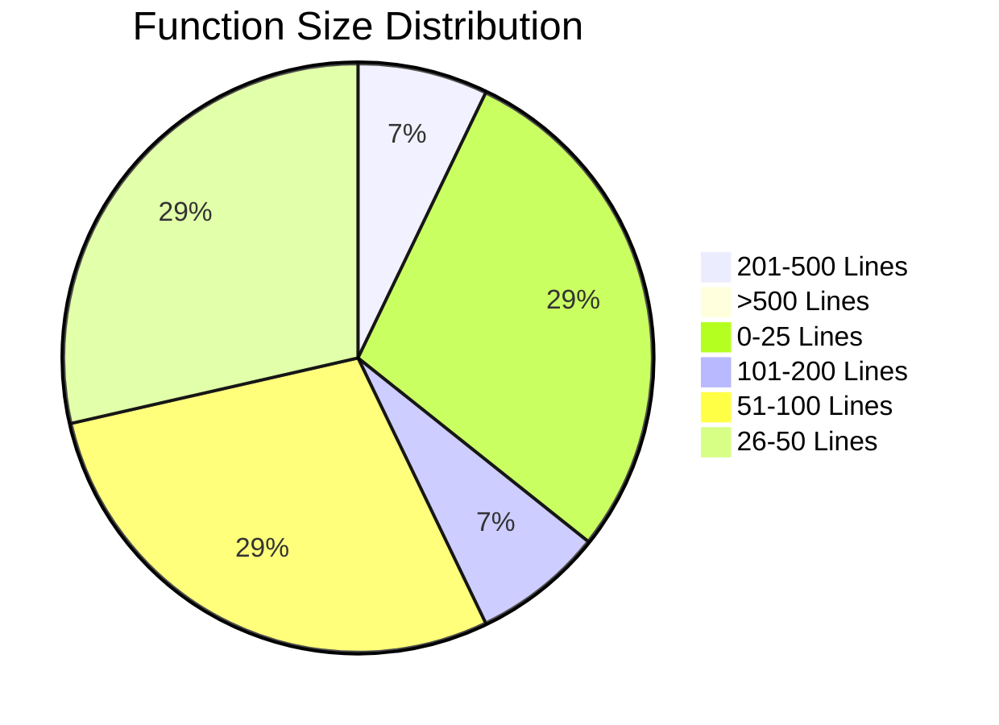
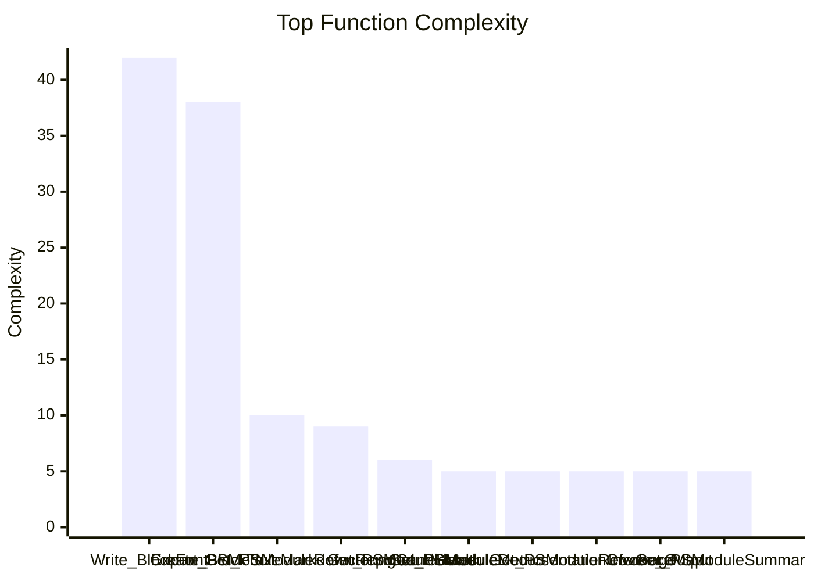

# PowerShell Module Quantity Analysis
`Date of Analysis: 2026-03-13 18:06:06`
## Module Information
| Property | Value |
|---|---|
| Module | PSModuleQuantityAnalyzer |
| Version | 2026.3.13.420 |
| Last Update | 2026-03-13 17:53:37 |
| Path | C:\Users\HolgerZimmermann\OneDrive - mrhozi\PowerShell Module\PSModuleQuantityAnalyzer\2026.3.13.420 |

## Module Metrics
| Metric | Value |
|---|---|
| Total Functions | 29 |
| Public Functions | 13 |
| Private Functions | 16 |
| Total Lines | 1830 |
| Lines of Code | 1449 |
| Comment Lines | 38 |
| Comment Ratio | 2.08 % |
| Average Function Size | 65.36 |
| Largest Function | Write-BlockFont |
| Largest Function Lines | 386 |
| Largest Function File | Write-BlockFont.ps1 |

## Function Inventory

| Function | Help Topics | Total Lines | Code | Comments | References | File |
|---|---|---|---|---|---|---|
| Create-BlockText | 0 | 229 | 211 | 4 | 2 | Write-BlockFont.ps1 |
| Export-PSModuleMarkdownReport | 6 | 187 | 142 | 2 | 0 | Export-PSModuleMarkDownReport.ps1 |
| Export-PSModuleQuantityReport | 6 | 21 | 14 | 0 | 0 | Export-PSModuleQuantityReport.ps1 |
| Get-FunctionHelpLines_old | 0 | 26 | 19 | 0 | 0 | Get-PSHelpTopics.ps1 |
| Get-FunctionName | 0 | 12 | 4 | 6 | 1 | Get-FunctionName.ps1 |
| Get-PSFunctionDefinitions | 0 | 29 | 22 | 0 | 1 | Get-PSFunctionDefinitions.ps1 |
| Get-PSFunctionReferenceCount | 0 | 24 | 16 | 0 | 0 | Get-PSFunctionReferenceCount.ps1 |
| Get-PSFunctionReferenceCount_old | 0 | 29 | 20 | 0 | 0 | Get-PSFunctionReferenceCount.ps1 |
| Get-PSHelpTopics | 0 | 42 | 35 | 0 | 1 | Get-PSHelpTopics.ps1 |
| Get-PSModuleAstCache | 0 | 25 | 18 | 0 | 1 | Get-PSModuleAstCache.ps1 |
| Get-PSModuleComplexity | 6 | 54 | 39 | 0 | 3 | Get-PSModuleComplexity.ps1 |
| Get-PSModuleDependencyGraph | 6 | 53 | 37 | 0 | 1 | Get-PSModuleDependencyGraph.ps1 |
| Get-PSModuleDocumentationCoverage | 6 | 59 | 41 | 0 | 1 | Get-PSModuleDocumentationCoverage.ps1 |
| Get-PSModuleDuplicateFunctions | 6 | 32 | 24 | 0 | 1 | Get-PSModuleDuplicateFunctions.ps1 |
| Get-PSModuleHealth | 6 | 67 | 46 | 0 | 0 | Get-PSModuleHealth.ps1 |
| Get-PSModuleLargestFunctions | 6 | 21 | 17 | 0 | 1 | Get-PSModuleLargestFunctions.ps1 |
| Get-PSModuleMetrics | 6 | 85 | 65 | 0 | 1 | Get-PSModuleMetrics.ps1 |
| Get-PSModuleQuantity | 6 | 53 | 43 | 0 | 13 | Get-PSModuleQuantity.ps1 |
| Get-PSModuleRefactoringCandidates | 6 | 70 | 49 | 0 | 1 | Get-PSModuleRefactoringCandidates.ps1 |
| Get-PSModuleReferenceMap | 0 | 36 | 24 | 0 | 1 | Get-PSModuleReferenceMap.ps1 |
| Get-PSModuleSourceFiles | 0 | 14 | 12 | 0 | 1 | Get-PSModuleSourceFiles.ps1 |
| Get-PSModuleSummary | 6 | 67 | 47 | 0 | 2 | Get-PSModuleSummary.ps1 |
| Get-PSModuleUnusedPrivateFunctions | 6 | 27 | 22 | 0 | 2 | Get-PSModuleUnusedPrivateFunctions.ps1 |
| Invoke-Output | 0 | 110 | 91 | 8 | 2 | Invoke-Output.ps1 |
| Measure-PSFunctionLines | 0 | 21 | 16 | 0 | 1 | Measure-PSFunctionLines.ps1 |
| Test-ShadowStrings | 0 | 16 | 12 | 1 | 4 | Write-BlockFont.ps1 |
| Write-BlockFont | 6 | 386 | 339 | 12 | 0 | Write-BlockFont.ps1 |
| Write-Log | 0 | 35 | 24 | 5 | 3 | Write-Log.ps1 |

## Largest Functions
| Function | Lines | File |
|---|---|---|
| Write-BlockFont | 386 | Write-BlockFont.ps1 |
| Create-BlockText | 229 | Write-BlockFont.ps1 |
| Export-PSModuleMarkdownReport | 187 | Export-PSModuleMarkDownReport.ps1 |
| Invoke-Output | 110 | Invoke-Output.ps1 |
| Get-PSModuleMetrics | 85 | Get-PSModuleMetrics.ps1 |

## Unused Private Functions
| Function | File |
|---|---|
| Write-BlockFont | Write-BlockFont.ps1 |
| Get-PSFunctionReferenceCount_old | Get-PSFunctionReferenceCount.ps1 |
| Get-FunctionHelpLines_old | Get-PSHelpTopics.ps1 |
| Get-PSFunctionReferenceCount | Get-PSFunctionReferenceCount.ps1 |

## Refactoring Candidates

The following functions were identified as potential **refactoring candidates**.

- **LargeFunction** - Function exceeds the recommended size threshold.
- **HighComplexity** - Function contains many control structures (`if`, `switch`, `foreach`, etc.).

| Function | Issues |
|---|---|
| Export-PSModuleMarkdownReport | LargeFunction |
| Write-BlockFont | LargeFunction,HighComplexity |
| Create-BlockText | LargeFunction,HighComplexity |

## Function Size Distribution

## Complexity Ranking

## Function Dependency Graph (Top 25)

```mermaid
graph TD
    Export_PSModuleMarkdownReport["Export-PSModuleMarkdownReport"] --> Get_PSModuleSummary["Get-PSModuleSummary"]
    Export_PSModuleMarkdownReport["Export-PSModuleMarkdownReport"] --> Get_PSModuleMetrics["Get-PSModuleMetrics"]
    Export_PSModuleMarkdownReport["Export-PSModuleMarkdownReport"] --> Get_PSModuleLargestFunctions["Get-PSModuleLargestFunctions"]
    Export_PSModuleMarkdownReport["Export-PSModuleMarkdownReport"] --> Get_PSModuleUnusedPrivateFunctions["Get-PSModuleUnusedPrivateFunctions"]
    Export_PSModuleMarkdownReport["Export-PSModuleMarkdownReport"] --> Get_PSModuleRefactoringCandidates["Get-PSModuleRefactoringCandidates"]
    Export_PSModuleMarkdownReport["Export-PSModuleMarkdownReport"] --> Get_PSModuleQuantity["Get-PSModuleQuantity"]
    Export_PSModuleMarkdownReport["Export-PSModuleMarkdownReport"] --> Get_PSModuleQuantity["Get-PSModuleQuantity"]
    Export_PSModuleMarkdownReport["Export-PSModuleMarkdownReport"] --> Get_PSModuleComplexity["Get-PSModuleComplexity"]
    Export_PSModuleMarkdownReport["Export-PSModuleMarkdownReport"] --> Get_PSModuleDependencyGraph["Get-PSModuleDependencyGraph"]
    Export_PSModuleMarkdownReport["Export-PSModuleMarkdownReport"] --> Invoke_Output["Invoke-Output"]
    Get_PSModuleMetrics["Get-PSModuleMetrics"] --> Get_PSModuleQuantity["Get-PSModuleQuantity"]
    Get_PSModuleMetrics["Get-PSModuleMetrics"] --> Get_PSModuleComplexity["Get-PSModuleComplexity"]
    Get_PSModuleMetrics["Get-PSModuleMetrics"] --> Get_PSModuleDocumentationCoverage["Get-PSModuleDocumentationCoverage"]
    Get_PSModuleMetrics["Get-PSModuleMetrics"] --> Get_PSModuleDuplicateFunctions["Get-PSModuleDuplicateFunctions"]
    Get_PSModuleMetrics["Get-PSModuleMetrics"] --> Get_PSModuleUnusedPrivateFunctions["Get-PSModuleUnusedPrivateFunctions"]
    Get_PSModuleMetrics["Get-PSModuleMetrics"] --> Get_PSModuleSummary["Get-PSModuleSummary"]
    Get_PSModuleQuantity["Get-PSModuleQuantity"] --> Get_PSModuleSourceFiles["Get-PSModuleSourceFiles"]
    Get_PSModuleQuantity["Get-PSModuleQuantity"] --> Get_PSModuleAstCache["Get-PSModuleAstCache"]
    Get_PSModuleQuantity["Get-PSModuleQuantity"] --> Get_PSModuleReferenceMap["Get-PSModuleReferenceMap"]
    Get_PSModuleQuantity["Get-PSModuleQuantity"] --> Get_PSFunctionDefinitions["Get-PSFunctionDefinitions"]
    Get_PSModuleQuantity["Get-PSModuleQuantity"] --> Measure_PSFunctionLines["Measure-PSFunctionLines"]
    Get_PSModuleQuantity["Get-PSModuleQuantity"] --> Get_PSHelpTopics["Get-PSHelpTopics"]
    Write_BlockFont["Write-BlockFont"] --> Test_ShadowStrings["Test-ShadowStrings"]
    Write_BlockFont["Write-BlockFont"] --> Test_ShadowStrings["Test-ShadowStrings"]
    Write_BlockFont["Write-BlockFont"] --> Test_ShadowStrings["Test-ShadowStrings"]
    Write_BlockFont["Write-BlockFont"] --> Test_ShadowStrings["Test-ShadowStrings"]
    Write_BlockFont["Write-BlockFont"] --> Create_BlockText["Create-BlockText"]
    Write_BlockFont["Write-BlockFont"] --> Create_BlockText["Create-BlockText"]
    Create_BlockText["Create-BlockText"] --> Test_ShadowStrings["Test-ShadowStrings"]
    Create_BlockText["Create-BlockText"] --> Test_ShadowStrings["Test-ShadowStrings"]
    Create_BlockText["Create-BlockText"] --> Test_ShadowStrings["Test-ShadowStrings"]
    Create_BlockText["Create-BlockText"] --> Test_ShadowStrings["Test-ShadowStrings"]
    Invoke_Output["Invoke-Output"] --> Get_FunctionName["Get-FunctionName"]
    Invoke_Output["Invoke-Output"] --> Write_Log["Write-Log"]
    Invoke_Output["Invoke-Output"] --> Write_Log["Write-Log"]
    Invoke_Output["Invoke-Output"] --> Write_Log["Write-Log"]
    Export_PSModuleQuantityReport["Export-PSModuleQuantityReport"] --> Get_PSModuleQuantity["Get-PSModuleQuantity"]
    Export_PSModuleQuantityReport["Export-PSModuleQuantityReport"] --> Invoke_Output["Invoke-Output"]
    Get_PSModuleRefactoringCandidates["Get-PSModuleRefactoringCandidates"] --> Get_PSModuleQuantity["Get-PSModuleQuantity"]
    Get_PSModuleRefactoringCandidates["Get-PSModuleRefactoringCandidates"] --> Get_PSModuleComplexity["Get-PSModuleComplexity"]
    Get_PSModuleComplexity["Get-PSModuleComplexity"] --> Get_PSModuleQuantity["Get-PSModuleQuantity"]
    Get_PSModuleDependencyGraph["Get-PSModuleDependencyGraph"] --> Get_PSModuleQuantity["Get-PSModuleQuantity"]
    Get_PSModuleDocumentationCoverage["Get-PSModuleDocumentationCoverage"] --> Get_PSModuleQuantity["Get-PSModuleQuantity"]
    Get_PSModuleDuplicateFunctions["Get-PSModuleDuplicateFunctions"] --> Get_PSModuleQuantity["Get-PSModuleQuantity"]
    Get_PSModuleHealth["Get-PSModuleHealth"] --> Get_PSModuleQuantity["Get-PSModuleQuantity"]
    Get_PSModuleLargestFunctions["Get-PSModuleLargestFunctions"] --> Get_PSModuleQuantity["Get-PSModuleQuantity"]
    Get_PSModuleSummary["Get-PSModuleSummary"] --> Get_PSModuleQuantity["Get-PSModuleQuantity"]
    Get_PSModuleUnusedPrivateFunctions["Get-PSModuleUnusedPrivateFunctions"] --> Get_PSModuleQuantity["Get-PSModuleQuantity"]
```

