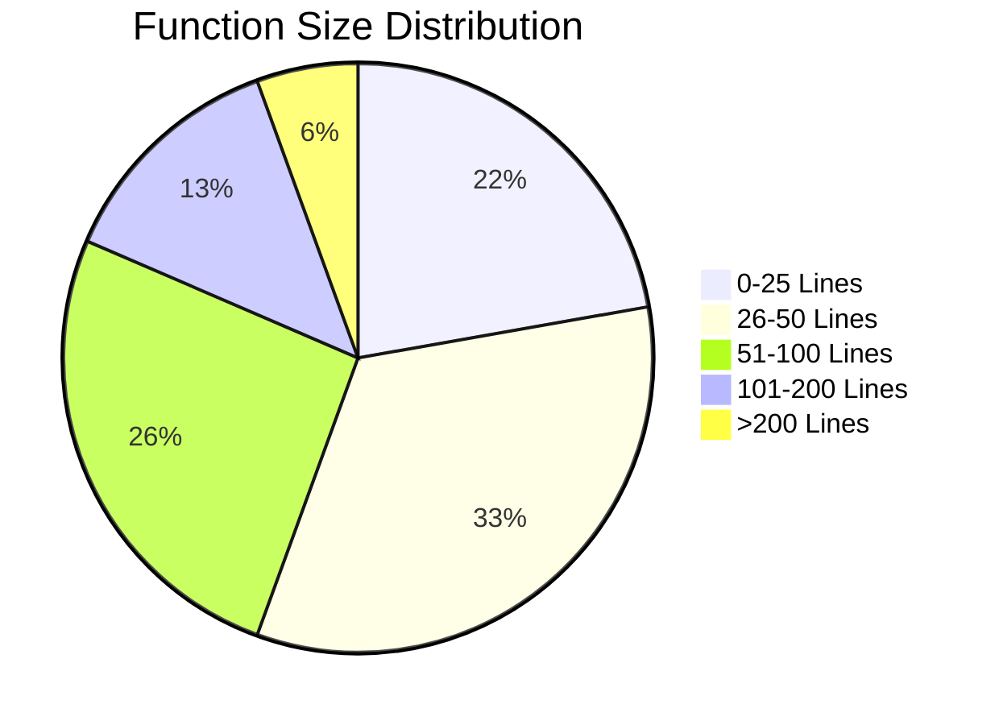
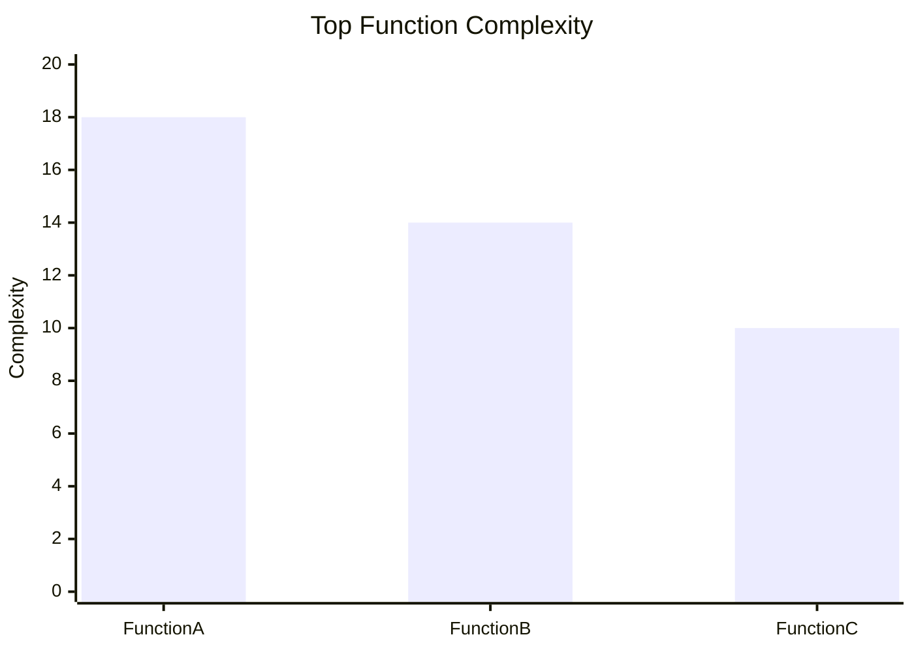
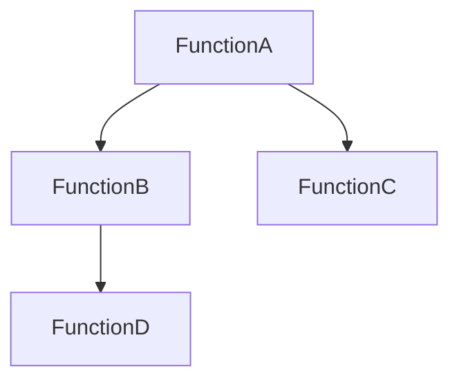

# PSModuleQuantityAnalyzer


**PSModuleQuantityAnalyzer** is a PowerShell module that performs **static analysis of PowerShell modules** and generates quantitative metrics about their structure, maintainability, and architecture.

It helps developers and automation engineers quickly understand the **size, complexity, and health of a PowerShell codebase**.

---

# 🚀 Key Capabilities

PSModuleQuantityAnalyzer analyzes PowerShell modules and produces insights such as:

### Function Inventory
- Total number of functions
- Public vs Private functions
- File location of functions
- Lines of code per function
- Comment lines per function
- Function reference count

### Code Metrics
- Total lines of code
- Comment ratio
- Average function size
- Largest functions in the module

### Maintainability Insights
- Large functions
- High complexity functions
- Refactoring candidates

### Architecture Insights
- Function dependency graph
- Detection of unused private functions
- Duplicate function detection

### Documentation Coverage
- Functions missing comment-based help
- Documentation coverage statistics

### Reporting
Reports can be exported as:

- Markdown reports (GitHub friendly)
- CSV reports
- Console summaries

---

# 📦 Installation

Install from the PowerShell Gallery:

```powershell
Install-Module PSModuleQuantityAnalyzer
```

Import the module:

```powershell
Import-Module PSModuleQuantityAnalyzer
```

---

# 🔎 Example Usage

Analyze a module:

```powershell
Get-PSModuleSummary -ModuleName ".\MyModule.psd1"
```

```powershell
Get-PSModuleSummary -ModuleName PSModuleQuantityAnalyzer | Select-Object Version, Function, HelpTopics, TotalLines, LinesOfCode, LinesOfComment, References, PartOfFile | ft
```

Generate a full Markdown report:

```powershell
Export-PSModuleMarkdownReport -ModuleName "ImportExcel"
```

---

# 📊 Example Output

## Module Metrics

| Metric | Value |
|------|------|
| Total Functions | 54 |
| Public Functions | 12 |
| Private Functions | 42 |
| Total Lines | 4820 |
| Lines of Code | 3412 |
| Comment Lines | 604 |
| Comment Ratio | 12.5 % |
| Average Function Size | 89 |

---

## 🔎 Function Inventory

| Function | Help Topics | Total Lines | Code | Comments | References | File |
|---|---|---|---|---|---|---|
| Access-Directory | 0 | 34 | 25 | 3 | 1 | Access-Directory.ps1 |
| Add-ADCSForAS2Go | 6 | 44 | 26 | 7 | 1 | Add-ADCSForAS2Go.ps1 |
| Add-GPOMemberToBuiltinGroups | 3 | 142 | 81 | 21 | 1 | Add-GPOMemberToBuiltinGroups.ps1 |
| Add-GPOScheduleTask | 6 | 86 | 47 | 11 | 1 | Add-GPOScheduleTask.ps1 |
| Add-GPOUserRightAssignments | 0 | 164 | 117 | 11 | 1 | Add-GPOUserRightAssignments.ps1 |
| Add-GroupElementToFileGroupsXml | 3 | 55 | 35 | 8 | 0 | Add-GroupElementToFileGroupsXml.ps1 |
| Add-Node | 0 | 28 | 27 | 0 | 7 | ChooseADOrganizationalUnit.ps1 |

---

# 📈 Function Size Distribution



---

# 🧠 Complexity Ranking



---

# 🧩 Function Dependency Graph



---

# 🛠 Public Commands

| Command |
|------|
Export-PSModuleMarkdownReport |
Export-PSModuleQuantityReport |
Get-PSModuleComplexity |
Get-PSModuleDependencyGraph |
Get-PSModuleDuplicateFunctions |
Get-PSModuleHealth |
Get-PSModuleLargestFunctions |
Get-PSModuleMetrics |
Get-PSModuleQuantity |
Get-PSModuleRefactoringCandidates |
Get-PSModuleSummary |
Get-PSModuleUnusedPrivateFunctions |

---

# 🎯 Use Cases

PSModuleQuantityAnalyzer can help with:

- Preparing modules for **PowerShell Gallery publication**
- Understanding **large legacy PowerShell modules**
- Detecting **dead code**
- Improving **documentation coverage**
- Identifying **refactoring candidates**
- Visualizing **module architecture**

---

# 🧭 Roadmap

Planned improvements:

- Code quality score
- Maintainability index
- Cyclomatic complexity analysis
- Architecture visualizations
- CI/CD integration

---

# 📜 License

MIT License

---

# 👤 Author

**Holger Zimmermann**

Cybersecurity Consultant focusing on:

- Active Directory Security
- PowerShell Automation
- Security Assessments   